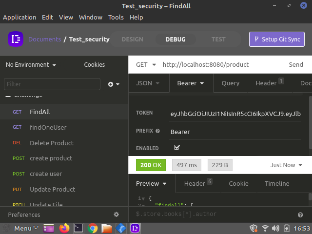
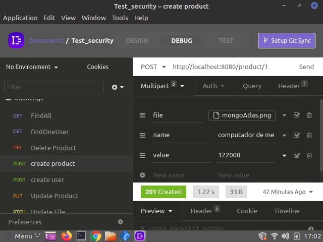

# Packages:

```
npm install express our yarn add express
npm install body-parser our yarn add body-parser
npm install mysql2 our yarn add mysql2
npm install sequelize our yarn add sequelize
npm install sequelize-cli -D our yarn add sequelize-cli -D
npm install bcrypt our yarn add bcrypt
npm install dotenv our yarn add dotenv
npm install jsonwebtoken our yarn add jsonwebtoken
npm install multer our yarn add multer


```

# Passos a seguir para rodar em ambiente local;

- Baixe o arquivo pelo github;

- Caminhe até a pasta no seu ambiente local e rode ```npm install``` para instalar as dependências;

- Insira os dados do seu banco local na pasta src/config/database.js ou em um arquivo de variável de ambiente(.env);

-Rode o comando:```yarn sequelize db:create``` para criar o banco de dados local;

- Rode o comando: ```yarn sequelize db:migrate``` para migrar as tabelas para o banco de dados.

- Tenha em seu pc o insomnia ou postman para conseguir testar as rotas.

- Faça o cadastro pela rota: ```http://localhost:8080/user```

- Faça o login pela rota: ``` http://localhost:8080/login ``` Nele será gerando um token de autenticação necessário para acessar as outras rotas, então o copie e coloque no headers authorization junto com um bearer.

**Exemplo no insomnia:**



Repita isso para em todas as rotas que exigem privilégio de autenticação.

- Para usar o multer procure por **Multipart Form** e informe o que pede nas requisições.

Um exemplo disso é rota post ```http://localhost:8080/product/:user_id```, que é precisa enviar o nome do produto, o valor e a imagem.

**Exemplo:**



### OBS: 

Para conseguir acessar as imagens clique na url dada no json da response e ele lhe enviará para o navegador que lhe permitirá visualizar ela.


